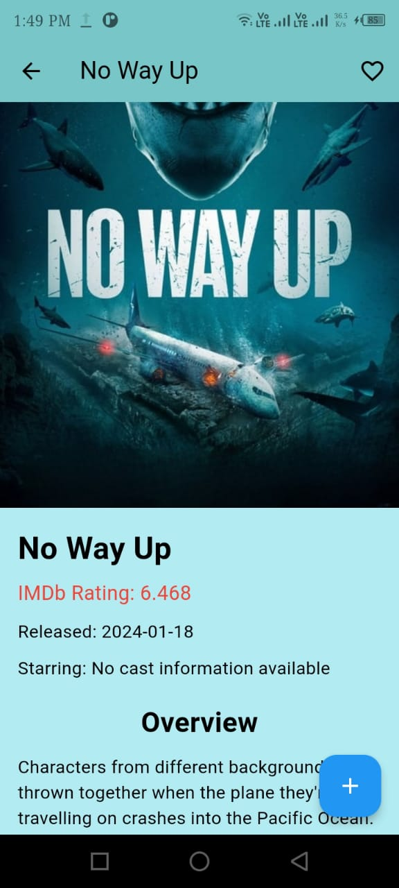
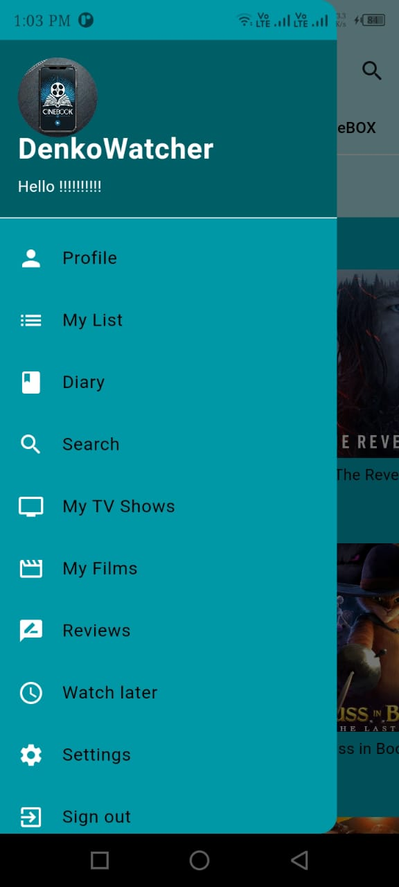
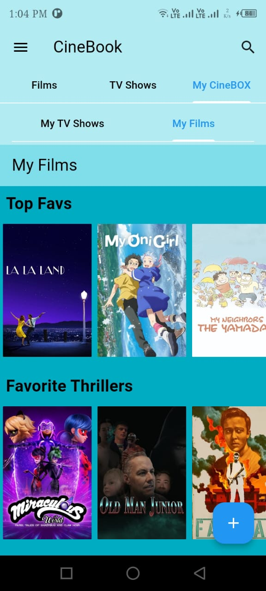
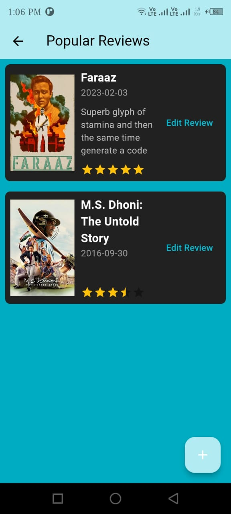
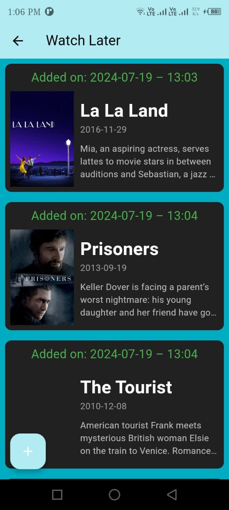
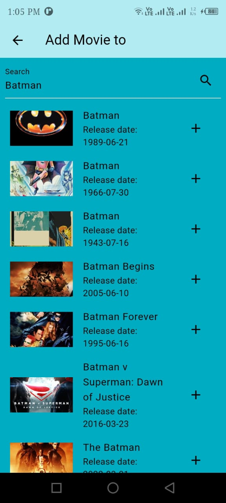
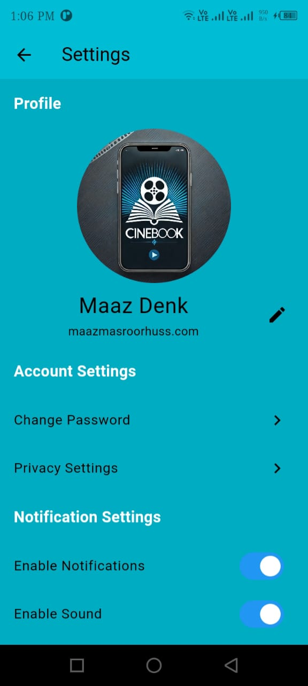
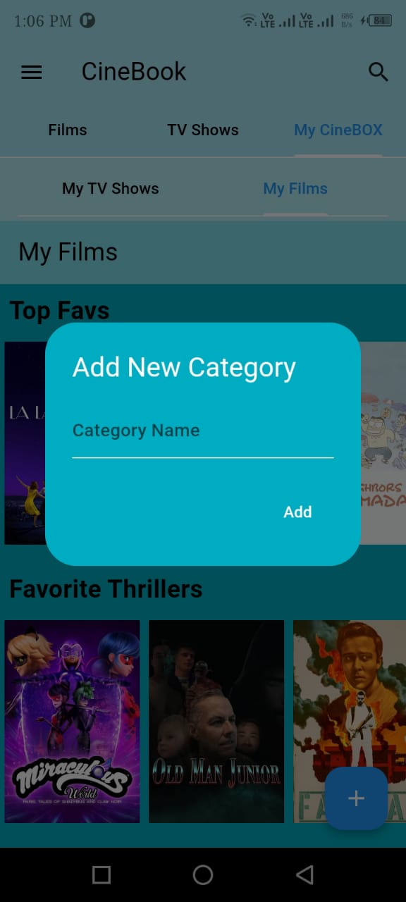

# 🎬 CineBOOK

### *Your Ultimate Movie & TV Show Organizer*

---

## 📖 Description

**CineBOOK** is a sleek and intuitive mobile application designed with Flutter, catering to movie buffs and TV show enthusiasts. With cineBOOK, discovering, organizing, and managing your favorite films and shows has never been easier.

---

## 🚀 Key Features

- **🔍 Discover New Content:** 
  - Browse through an extensive library of movies and TV shows across various genres.
  - Stay updated with the latest releases and trending content.

- **🎯 Search Functionality:** 
  - Effortlessly find your favorite movies and TV shows with our powerful search feature.

- **📂 Categorization:** 
  - Create custom categories to organize your movies and TV shows according to your preferences.
  - Shuffle categories and movies for a fresh experience every time.

- **📝 Detailed Information:** 
  - Access comprehensive details about each movie and TV show, including ratings, summaries, cast, and more.

- **📱 Offline Access:** 
  - Keep track of your watchlist and categories even without an internet connection.

---

## 📱 Screenshots
<p align="center">
  
  
  
  
   
  
  
   
  
  
  
  
</p>
---

## 🎥 Demo Video


---

## 🛠️ Tech Stack

- **Framework:** Flutter
- **Language:** Dart
- **API:** The Movie Database (TMDB) API

---

## 💡 How to Use

1. **Clone the Repository:**
    ```bash
    git clone https://github.com/yourusername/cineBOOK.git
    ```
2. **Navigate to the Project Directory:**
    ```bash
    cd cineBOOK
    ```
3. **Install Dependencies:**
    ```bash
    flutter pub get
    ```
4. **Run the App:**
    ```bash
    flutter run
    ```

---

## 📥 Contributing

We welcome contributions! Please read our [CONTRIBUTING.md](CONTRIBUTING.md) file for guidelines on how to contribute to this project.

---

## 📝 License

This project is licensed under the MIT License - see the [LICENSE.md](LICENSE.md) file for details.

---

## 🌐 Connect with Us

- **Website:** [cineBOOK.com](https://cineBOOK.com)
- **Twitter:** [@cineBOOKapp](https://twitter.com/cineBOOKapp)
- **Instagram:** [@cineBOOKapp](https://instagram.com/cineBOOKapp)

---

Thank you for using **CineBOOK**! Enjoy organizing and discovering your favorite movies and TV shows. 🎥🍿

---


--

Feel free to modify and enhance this README as needed to better reflect your project's details and branding!
